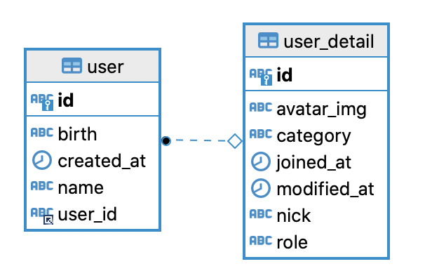

# Mapping

JPA Entity 작성에 대해서 간단히 알아 보았으니 이제는 Mapping 에 대해서 살펴 보자. 

JPA 는 기본적으로 Relation Database 를 활용하도록 설계 되어 있다. 

객체와 관계형 데이터베이스를 매핑 하는 것을 ORM(Object Relation Mapping) 이라고 하며, 이러한 데이터베이스의 관계를 객체도 동일하게 적용하기 위해서 Mapping 이라는 방법을 이용한다. 

이번 아티클에서는 User 엔터티를 이용하여 One To One 매핑을 진행해 볼 것이다. 

## One To One Mapping

UserInfo 이라는 엔터티가 있다. UserInfo 은 사용자의 기본정보를 저장한다고 해보자. 

- Id: 사용자 아이디
- Name: 사용자 이름 
- Birth: 생년월일 YYYYMMDD
- CreatedAt: 생성일시 

UserDetailInfo 는 현재 어플리케이션에서 사용자의 상세 정보를 저장한다고 하고 다음과 같은 필드를 가진다고 해보자. 

- Id: 사용자 아이디 
- Nick: 사용자 닉네임 
- AvatarImg: 사용자 아바타 이미지 
- Category: 사용자의 카테고
- Role: 사용자의 역할 
- JoinedAt: 사용자 가입 시점
- ModifiedAt: 사용자 상세정보 수정 시점   
리
이렇게 사용자의 정보를 기본정보와 상세정보로 구분하면 우리는 1:1 관계로 매핑할 수 있다. 

어떻게 보면 이렇게 2개의 테이블로 분리 저장하는 것이 합당하게 보이지 않을 수 있다. 그러나 사용자 정보는 도메인이라는 기준으로 분리하면 실제 사용자와, 어플리케이션 내의 사용자를 분리하여 보관하는 것이 더욱 명확하고, 관리가 쉽다. 

## 엔터티 작성하기. 

위에서 정의한 대로 엔터티를 작성해보자. 

com.schooldevops.practical.simpleboard.entity.User.java

```
package com.schooldevops.practical.simpleboard.entity;

import com.schooldevops.practical.simpleboard.dto.UserDto;
import com.schooldevops.practical.simpleboard.entity.converter.LocalDateTimeConverter;
import lombok.*;

import javax.persistence.*;
import java.time.LocalDateTime;

@Getter
@Setter
@NoArgsConstructor
@AllArgsConstructor
@Builder
@Entity
@Table(name = "user")
public class User {

    @Id
    @Column(name = "id", unique = true)
    private String id;

    @Column
    private String name;

    @Column
    private String birth;

    @Column
    @Convert(converter = LocalDateTimeConverter.class)
    private LocalDateTime createdAt;

}


```

위와 같이 User 엔터티를 만들었다. 아직 매핑은 만들지 않았다. 

다음으로 com.schooldevops.practical.simpleboard.entity.UserDetail.java 를 생성하자. 

```
package com.schooldevops.practical.simpleboard.entity;

import com.schooldevops.practical.simpleboard.constants.Role;
import com.schooldevops.practical.simpleboard.dto.UserDetailDto;
import com.schooldevops.practical.simpleboard.entity.converter.LocalDateTimeConverter;
import lombok.*;

import javax.persistence.*;
import java.time.LocalDateTime;

@Getter
@Setter
@AllArgsConstructor
@NoArgsConstructor
@Builder
@Entity
@Table(name = "UserDetail")
public class UserDetail {

    @Id
    @Column(name = "id", unique = true)
    private String id;

    @Column
    private String nick;

    @Column
    private String avatarImg;

    @Column
    private String category;

    @Enumerated(EnumType.STRING)
    @Column
    private Role role;

    @Column
    @Convert(converter = LocalDateTimeConverter.class)
    private LocalDateTime joinedAt;

    @Column
    @Convert(converter = LocalDateTimeConverter.class)
    private LocalDateTime modifiedAt;

}

```

위 내용은 지금까지 살펴본 내용과 같다. 한가지 다른점은 Enum 속성을 가질 수 있도록 Role 을 이용하였고, Annotation 을 @Enumerated 를 이용하고 있다는 것이 다르다. 

Role Enum 객체는 다음과 같다. 

com.schooldevops.practical.simpleboard.constants.Role.java

```
package com.schooldevops.practical.simpleboard.constants;

public enum Role {
    USER, GROUP_ADMIN, SUPER_ADMIN
}

```

### Emnum 타입

우리는 Enum 을 ` @Enumerated(EnumType.STRING)` 와 같이 작성했다. 

EnumType 에는 다음과 같이 2가지가 있다. 

- EnumType.STRING: Enum 타입을 문자형태로 저장한다. 그러면 DB 에 저장되는 값은 USER, GROUP_ADMIN, SUPER_ADMIN 중에 하나가 저장된다. 
- EnumType.ORDINAL: 이는 Enum 타입의 순서값을 저장한다. 즉 (User(1), GROUP_ADMIN(2), SUPER_ADMIN(3)) 으로 매핑된 순서값을 저장한다. 1, 2, 3 중 하나가 저장된다. 

EnumType 이용할때에는 일반적으로 STRING 을 이용하는 것이 좋다. ORDINAL 을 이용한다면 Enum 의 순서를 유지하는 것이 필요하다. 만약 새로운 Enum 값을 추가한다면 기존 순서는 유지한 끝에 Enum 값을 저장해야함을 명심하자. 

## 단방향 OneToOne 매핑

이제 User 가 UserDetail 을 가지는 단방향 매핑을 해보겠다. 

com.schooldevops.practical.simpleboard.entity.User.java 소스 코드에 다음과 같이 추가하자. 

```
... 생략 ...
    @JoinColumn(name = "user_id", unique = true)
    @OneToOne(fetch = FetchType.LAZY, cascade = CascadeType.ALL, orphanRemoval = true)
    private UserDetail userDetail;
... 생략 ...

```

- @JoinColumn 은 엔터티 간의 Join 을 어떠한 칼럼으로 수행할지 지정한다. unique = true 해당 칼럼이 유니크 해야함을 의미한다.
- foreignKey = @ForeignKey(name = "fk_user_detail") 은 foreignKey 를 이용하면 foreign key 이름을 직접 자정할 수 있다.   
- @OneToOne 은 1:1 매핑을 의미한다. 
- fetch = FetchType.LAZY 은 조인된 엔터티를 가져올때 필요에 의해서만 UserDetail 을 가져온다는 의미이다. EAGER 인경우 조인쿼리를 활용하여 한꺼번에 Detail의 데이터를 가져오게 된다. 
- cascade = CasdadeType.ALL 과 같이 cascade 를 설정해주면 User 에 발생하는 오퍼레이션이 UserDetail 에도 그대로 전파됨을 의미한다. 이 옵션에 대해서는 차후에 알아볼 것이다. 
- orphanRemoval = true 로 해주면 부모인 User 가 삭제되는 경우 자식역시 삭제 되어야 함을 의미한다. 데이터가 부모가 없으면 자식도 없는 주종관계일경우 이 옵션을 걸어주자. 서로 독립적인 데이터라면 이 옵션은 제거 되어야한다. 

그리고 실행 해보면 테이블이 다음과 같이 생성되었다. 

```
Hibernate: 
    
    create table user (
       id varchar(255) not null,
        birth varchar(255),
        created_at datetime(6),
        name varchar(255),
        user_id varchar(255),
        primary key (id)
    ) engine=InnoDB
```

```
Hibernate: 
    
    create table user_detail (
       id varchar(255) not null,
        avatar_img varchar(255),
        category varchar(255),
        joined_at datetime(6),
        modified_at datetime(6),
        nick varchar(255),
        role varchar(255),
        primary key (id)
    ) engine=InnoDB
Hibernate: 
    
    alter table user 
       add constraint fk_user_detail 
       foreign key (user_id) 
       references user_detail (id)
```

위와 같이 2개의 테이블이 생성되었다. 관계 매핑이 기본 키로 설정이 되었으며, Foreign Key 역시 우리가 지정한 이름으로 생성되었음을 확인할 수 있다. 



관계 다이어 그램을 보면 위처럼 확인할 수 있다. 