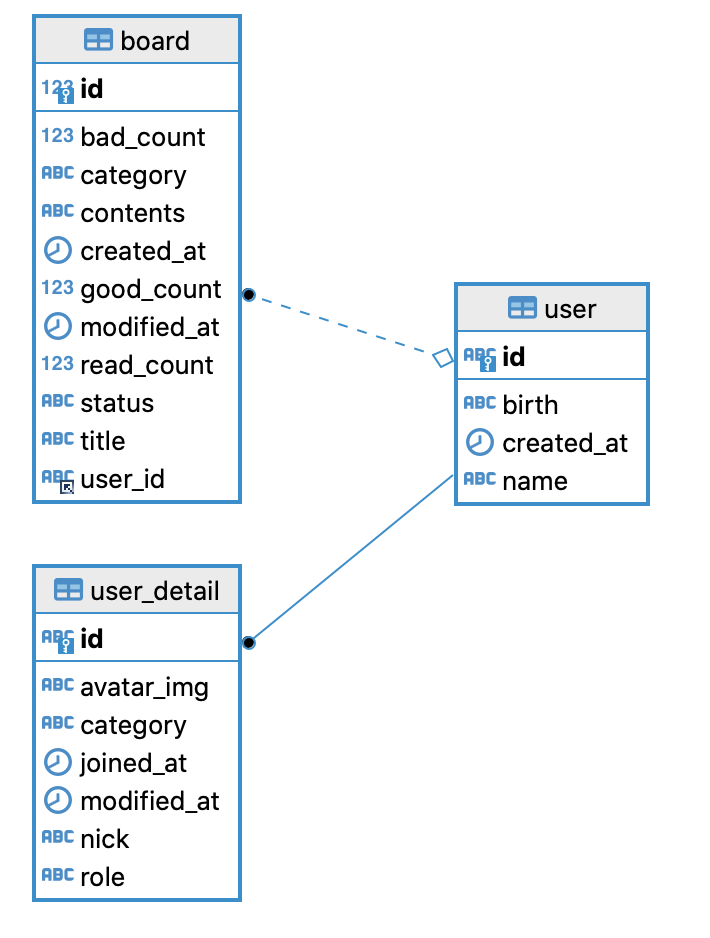

# OneToMany 

이제는 OneToMany 를 알아볼 차례이다. 

DB 모델링중 가장 일반적인 케이스인 OneToMany 를 JPA 에서 어떻게 구현하는지 확인해보자. 

## 시나리오. 

User를 만들었고, User 로 등록된 사람은 Board를 작성할 수 있다고 해보자. 

User는 여러개의 Board Content를 작성할 수 있다. User:Board = 1:N 관계가 성립된다.

## Board 속성 작성하기. 

게시판의 가장 기본적인 테이블 구조는 다음과 같다. 

- id: 게시판 아이디 
- category: 게시물 카테고리 (GENERAL, BOARD, NOTICE)
- title: 게시물 제목 
- contents: 게시물 내용 
- user_id: 작성자 아이디  
- readCount: 조회수 
- goodCount: 좋아요 횟수 
- badCount: 싫어요 횟수 
- status: 컨텐츠 상태 (DRAFT, ISSUED, DELETED)
- createdAt: 생성일시 
- modifiedAt: 수정일시 

위와 같이 테이블이 생성이 될 것이다. 긜고 user_id 를 이용하여 user테이블의 id와 연관관계를 맺게 된다. 

즉, 연관관계를 가진 소유자는 board 가 되는 것이다. 

## 연관 생성하기. 

이제는 엔터티를 생성하고 User 엔터티와, Board 엔터티 사이의 연관을 맺어보자. 

### User Entity 

```
package com.schooldevops.practical.simpleboard.entity;

import com.schooldevops.practical.simpleboard.dto.UserDto;
import com.schooldevops.practical.simpleboard.entity.converter.LocalDateTimeConverter;
import lombok.*;

import javax.persistence.*;
import java.time.LocalDateTime;
import java.util.List;

@Getter
@Setter
@NoArgsConstructor
@AllArgsConstructor
@Builder
@Entity
@Table(name = "user")
public class User {

    @Id
    @Column(name = "id", unique = true)
    private String id;

    @Column
    private String name;

    @Column
    private String birth;

    @Column
    @Convert(converter = LocalDateTimeConverter.class)
    private LocalDateTime createdAt;

    @OneToOne(mappedBy = "user", fetch = FetchType.LAZY, cascade = CascadeType.ALL, orphanRemoval = true)
    private UserDetail userDetail;

    public void setUserDetail(UserDetail userDetail) {
        this.userDetail = userDetail;
        userDetail.setUser(this);
    }

    @OneToMany(mappedBy = "user", fetch = FetchType.LAZY)
    private List<Board> boards;

    @Transient
    public UserDto getDTO() {
        UserDto userDTO = UserDto.builder()
                .id(this.id)
                .name(this.name)
                .birth(this.birth)
                .createdAt(this.createdAt)
                .build();

        if (userDetail != null) {
            userDTO.setUserDetail(userDetail.getDTO());
        }
        return userDTO;
    }
}

```

위 내용에서 새로 추가된 부분은 다음 코드 조각이다. 

```
    @OneToMany(mappedBy = "user", fetch = FetchType.LAZY)
    private List<Board> boards;
```

- @OneToMany: User 1명이 여러개의 Board 를 가질 수 있으므로 User측 입장에서는 OneToMany 이다. 
- mappedBy: 테이블의 연관을 맺어주고, JPA 가 user와 board 의 관계를 이해할 수 있도록 연관 키를 소유한 소유자는 Board 라고 알려준다. 
- fetch = FetchType.LAZY: User를 조회할때 모든 Board 를 가져올 필요는 없으므로 LAZY 페치 타입을 설정한다. 필요시에만 조회하면 된다. 
- List<Board> boards: 한명의 사용자가 여러개의 게시물을 가질 수 있으므로 List를 사용했다. 중복을 허용하지 않는경우 Set 등을 사용하면 된다. 

### Board Entity

이제는 Board 엔터티를 작성할 차례이다. 

처음에 정의한 Board 속성대로 아래와 같이 작성해주자. 

```
package com.schooldevops.practical.simpleboard.entity;

import com.schooldevops.practical.simpleboard.constants.BoardCategory;
import com.schooldevops.practical.simpleboard.constants.ContentStatus;
import com.schooldevops.practical.simpleboard.dto.BoardDto;
import com.schooldevops.practical.simpleboard.entity.converter.BooleanYNConverter;
import com.schooldevops.practical.simpleboard.entity.converter.LocalDateTimeConverter;
import lombok.*;

import javax.persistence.*;
import java.time.LocalDateTime;

@AllArgsConstructor
@NoArgsConstructor
@Getter
@Setter
@Builder
@Entity
@Table(name = "board")
public class Board {

    @Id
    @GeneratedValue(strategy = GenerationType.IDENTITY)
    private Long id;

    @Column(nullable = false)
    @Enumerated(EnumType.STRING)
    private BoardCategory category;

    @Column(nullable = false)
    private String title;

    @Column(nullable = false)
    private String contents;

    @JoinColumn(name = "user_id", foreignKey = @ForeignKey(name = "FK_Board_to_user"))
    @ManyToOne
    private User user;

    @Column(nullable = false)
    private Integer readCount = new Integer(0);

    @Column(nullable = false)
    private Integer goodCount = new Integer(0);

    @Column(nullable = false)
    private Integer badCount = new Integer(0);

    @Enumerated(EnumType.STRING)
    @Column(nullable = false)
    private ContentStatus status;

    @Convert(converter = LocalDateTimeConverter.class)
    @Column(nullable = false)
    private LocalDateTime createdAt = LocalDateTime.now();

    @Convert(converter = LocalDateTimeConverter.class)
    private LocalDateTime modifiedAt;

    @Transient
    public BoardDto getDTO() {
        return BoardDto.builder()
                .id(this.id)
                .category(this.category)
                .title(this.title)
                .contents(this.contents)
                .user(this.user.getDTO())
                .readCount(this.readCount)
                .goodCount(this.goodCount)
                .badCount(this.badCount)
                .status(this.status)
                .createdAt(this.createdAt)
                .modifiedAt(this.modifiedAt)
                .build();
    }
}

```

위 코드는 우리가 일반적으로 지금까지 작성한 Entity 와 다를 것이 없다. 

다만 다른 부분은 다음 코드 조각이다.  

```
    @JoinColumn(name = "user_id", foreignKey = @ForeignKey(name = "FK_Board_to_user"))
    @ManyToOne
    private User user;
```

- @JoinColumn: 외래키를 지정하도록 조인 칼럼을 지정해준다. 
- name="user_id": 우리는 user의 아이디를 참조할때 board 테이블에 있는 user_id 로 참조를 하겠다는 의미이다. 
- foreignKey: 직접 FK 이름을 지정하기 위해서 위 내용처럼 작성해 주었다. FK 이름은 FK_Board_to_user 이다. 
- @ManyToOne: board 입장에서는 여러개의 board 게시물을 1명의 user 가 작성할 수 있으므로 ManyToOne 로 지정했다. 

## 테이블 생성 결과 확인하기. 

지금까지 내용으로 User 와 Board 에 생성된 테이블 스키마를 확인해보자. 

```
Hibernate: 
    
    create table board (
       id bigint not null auto_increment,
        bad_count integer not null,
        category varchar(255) not null,
        contents varchar(255) not null,
        created_at datetime(6) not null,
        good_count integer not null,
        modified_at datetime(6),
        read_count integer not null,
        status varchar(255) not null,
        title varchar(255) not null,
        user_id varchar(255),
        primary key (id)
    ) engine=InnoDB
```

테이블에 user_id 가 생성되었음을 확인할 수 있다. 

```
Hibernate: 
    
    create table user (
       id varchar(255) not null,
        birth varchar(255),
        created_at datetime(6),
        name varchar(255),
        primary key (id)
    ) engine=InnoDB
```

user 테이블은 이전과 달라진게 없다. 

```
Hibernate: 
    
    alter table board 
       add constraint FK_Board_to_user 
       foreign key (user_id) 
       references user (id)
```

JPA가 생성한 Foreign Key 제약은 위처럼 만들어 졌다. 즉, board 테이블에 Foreign key 가 생성이 되었고 (즉 참조키인 user_id의 소유자는 board라고 이전에 mappedBy 로 지정한 것을 확인하자.) 
참조하는 필드는 user 테이블의 id 값으로 선언되었다. 



다이어그램을 확인해보면 정상적으로 우리가 원하는 1:N 관계로 user와 board가 생성 되었음을 확인할 수 있다. 

지금까지 OneToMany 를 확인할 수 있었다. 

중요한 것은 OneToMany 관계를 매핑할때, 연관 키를 누가 가지고 연관을 맞을 것인지에 따라서 mappedBy 를 적절히 설정하면 JPA가 원하는 형태로 테이블을 생성해준다. 


