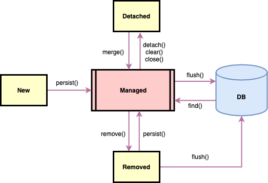

# JPA Entity Lifecycle

JPA 를 이해하는데 Lifecycle 은 필수적인 항목이라고 할 수 있다. 

일반적으로 많이 사용하는 Mybatis 와 JDBCTemplate 등은 실제 DB 에 바로 쿼리를 요청하는 방식으로 진행이 일어난다. 

- 실제 Query 작성 
- Transaction begin 으로 트랜잭션 획득
- Query 수행
- Transaction commit or rollback 으로 DB 반영. 

위와 같은 일련의 과정으로 DB와 이터렉션이 처리가 된다. 

JPA는 조금 다른 방식으로 처리되며, 영속상태 혹은 관리 상태에 엔터티를 두고, 특정 시점이 되면 DB 에 반영하는 형태로 오퍼레잇션이 일어난다. 

## Entity Lifecycle



위 그림과 같이 JPA 는 상태를 가진다. 

- 노란색 상태. 
    이 상태는 엔터티가 메모리에 올라와 있지만 실제 DB에 반영이 되지 않는 상태를 말한다. 
    - New : Transient 상태이며 최초로 엔터티가 생성이 되면 초기 상태를 말한다. 
    - Detached : 이 상태는 DB와 연동된 상태(Managed) 에서 연동이 끊어진 상태이며, 엔터티가 객체 인스턴스로의 역할을 수행한다. 
    - Removed: DB 에 삭제가 일어나고, 동시에 DB와 연동이 끊어진 상태이다.  
- 붉은색 상태
    이 상태는 DB와 연동된 상태이며 Managed 상태 혹은 영속상태(Persist) 라고 한다. 실제 특정 주기가 되면 DB에 반영을 하거나, DB로 부터 조회를 할 수 있다. 
    
## 각 오퍼레이션별 상태 알아보기. 

- New 상태에서 persist()
    - new 상태는 객체 인스턴스만 생성이 된 상태이다. 엩터티 객체는 순수하게 Java의 POJO 로 볼 수 있다. 
    - persist() 를 수행하면 Managed 상태가 된다. (이때에도 바로 DB에 저장되는 것이 아니라. 특정 주기가 되면 DB에 내용을 반영한다. )
- Managed 상태에서 Detach 상태로
    - Managed 상태에 있는 엔터티는 엔터티 객체를 수정하면 DB에 저장이 일어난다.
    - 이러한 상태에서 detach() 를 수행하거나, clear(), close() 르 수행하면 Detache 상태로 전환이 된다. 
    - 이 말은 엔터티의 속성값을 변경을 하더라도 DB 에 전혀 반영이 안된다. 단지 Entity 는 Java 객체 인스턴스로 동작하게 된다. 
- Detach 상태에서 Managed 상태로 
    - Detach 상태에서 엔터티를 merge() 메소드를 수행하면 엔터티가 Managed 상태로 변경이 된다. 
    - 이때 DB 에 있는 기존값을 조회하고, detach 된 상태에 있던 속성값과 비교하여 변경사항을 다시 DB에 반영한다. (이 작업이 merge이다.)
- Managed 상태에서 Removed 상태로
    - 엔터티를 remove() 하게 되면 실제 DB 내용을 삭제하고, 삭제된 엔터티는 Removed 상태로 변경이 된다. 
    - 이 removed 된 상태의 객체는 그림에서와 같이 persist 할 수 있지만, 그냥 삭제되어 gc 대상이 되도록 하는 것이 좋다. 
    
## 지금까지 Entity 라이프 사이클 적용하기. 

지금까지 Entity Lifecycle 를 살펴 보았다. 

우리가 지금까지 해온 JPARepository, CRUDRepository 등은 실제적으로 EntityManager 를 내부적으로 감싸고 있는 추상화된 리포지토리이다. 

이 추상화된 리포지토리를 사용하는 경우에는 위 메소드처럼 persist(), clear(), remove() 등이 따로 있지 않고, save(), get() 등의 메소드만 존재한다. 

이를 이용하기 위해서는 EntityManager 를 wired 해야하며. 이렇게 wired 한 내용을 살펴 보자. 

UserService.java 를 다음과 같이 내용을 추가하자. 

```
... 중간생략 ...
    @PersistenceContext
    EntityManager em;

    final UserRepository userRepository;
    final RoleRepository roleRepository;

    @Autowired
    public UserService(UserRepository userRepository, RoleRepository roleRepository) {
        this.userRepository = userRepository;
        this.roleRepository = roleRepository;
    }

    @Transactional
    public UserDto saveUserUsingEM(UserDto user) {
        User userEntity = user.getEntity();

        this.em.persist(userEntity);
        userEntity.setName("Modified Name:");

        this.em.detach(userEntity);

        return userEntity.getDTO();
    }

... 중간생략 ...
``` 
  
위 내용에서 추가된 내용은 다음과 같다. 

```
    @PersistenceContext
    EntityManager em;
```

- @PersistenceContext: 영속성 컨텍스트를 조회하는 것으로 현재 세션에서 EntityManager 를 wired 시켜준다. 
- EntityManager: 엔터티 매니저는 현재 세션에서 엔터티를 직접 관리할 수 있도록 해준다. EntityManager 은 EntityManagerFactory 에 의해서 생성이 되며, EntityManagerFactory 는 어플리케이션에서 DB당 한개가 생긴다. 즉 전체 어플당 1개이다. 
    - EntityManager 은 EntityManagerFactory가 세션당 하나씩 할당해준다고 생각하면 된다. 

다음으로 생성해야할 코드는 아래와 같다. 

```
    @Transactional
    public UserDto saveUserUsingEM(UserDto user) {
        User userEntity = user.getEntity();

        this.em.persist(userEntity);
        userEntity.setName("Modified Name:");

//        this.em.detach(userEntity);
//        userEntity.setName("Modified Name2:");

        return userEntity.getDTO();
    }
```

- @Transactional: 영속성 컨텍스트는 트랜잭션 내에서 동작한다. 그러므로 @Transactional 어노테이션을 꼭 넣어줘서 트랜잭션 내에 포함되도록 하자. 
    - 실제 Entity 는 트랜잭션 종료시 DB에 내용을 반여하며, 트랜잭션이 종료되면 자동으로 DB에서 Detach 된다. 이후에 find 를 하면 상태 오류를 보게 될 것이다. 
- em.persist(<entity>): 이를 통해서 entity를 Managed 상태로 두었다. 트랜잭션이 종료되면 내용이 DB에 저장이 될 것이다. 
- userEntity.setName("Modified Name:"): 이렇게 엔터티 내용을 변경했으므로 함수를 빠져나올때 DB에 변경된 내용이 저장될 것이다. 


### 실행결과 확인하기. 

```
Hibernate: 
    insert 
    into
        user
        (birth, created_at, name, id) 
    values
        (?, ?, ?, ?)

... 중략 ...

Hibernate: 
    update
        user 
    set
        birth=?,
        created_at=?,
        name=? 
    where
        id=?

```

위 내용을 보면 insert 를 수행하고, 다시 update를 수행했음을 알 수 있다. 


## detach 수행하기. 

이제 detach 를 해보면 어떻게 될까? 

```
    @Transactional
    public UserDto saveUserUsingEM(UserDto user) {
        User userEntity = user.getEntity();

        this.em.persist(userEntity);
        userEntity.setName("Modified Name:");

        this.em.detach(userEntity);
        userEntity.setName("Modified Name2:");

        return userEntity.getDTO();
    }
```

- em.detach(userEntity): 이렇게 detach 를 시켜 보았다. 영속 상태가 아니므로 변경된 내용은 저장되지 않는다. (즉 위 결과를 실행하면 DB에 저장되지 않는다. persist 하고 나서, detach 수행했기 때문에 트랜잭션이 빠져 나올때, 영속성 객체는 존재하지 않는다.)

결과를 확인해보면 DB에는 저장데이터가 없다. 

detach 는 영속상태가 아니므로 트랜잭션 종료 @Transactional 에서 함수 밖을 빠져나오면서 DB에 저장할 영속성 객체가 없으므로 DB에 작업이 발생하지 않는다. 

## Wrapup

지금까지 Entity의 라이프 사이클을 살펴 보았다. 

영속상태가 무엇인지, 그리고 준영속상태 (detach) 가 어떠한 의미를 갖는지 이해해 보았다. 

jpa를 활용할때 꼭 이해하고 있어야 하는 부분이므로, 위 내용을 숙지하면 이용에 도움이 될 것이다. 
